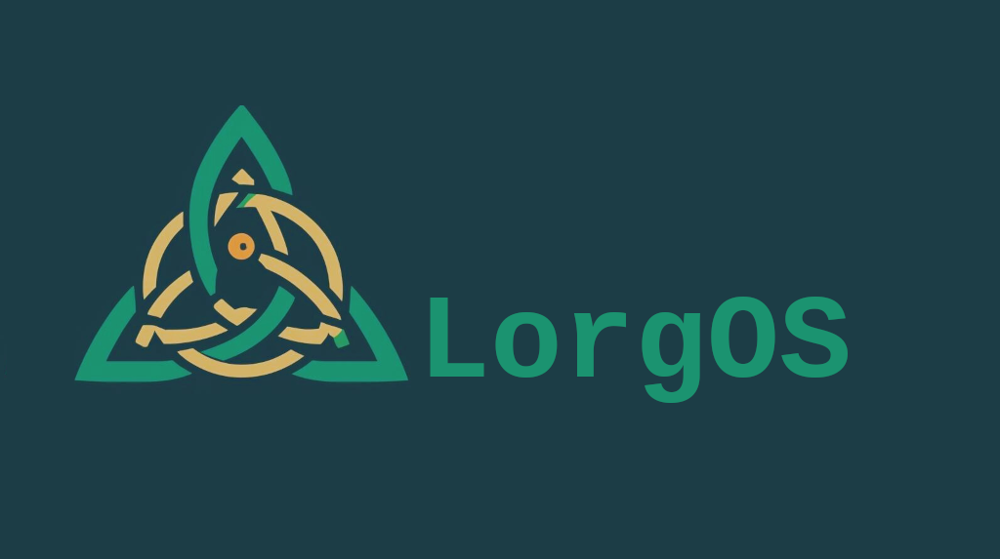

# LorgOS pkgbuild 

**LorgOS** is a custom Arch Linux ISO based on learnigs from ArcoLinux and ongoing efforts within [KIRO](https://github.com/kirodubes) project. Contained within this folder are the configurations for Calamares installer. 

## 🚀 Features

- Fully customizable build process
- Based on official Arch Linux tools and methodology
- GUI from https://github.com/calamares/calamares
- Modular structure for easy extension
- Lightweight and minimal by default
